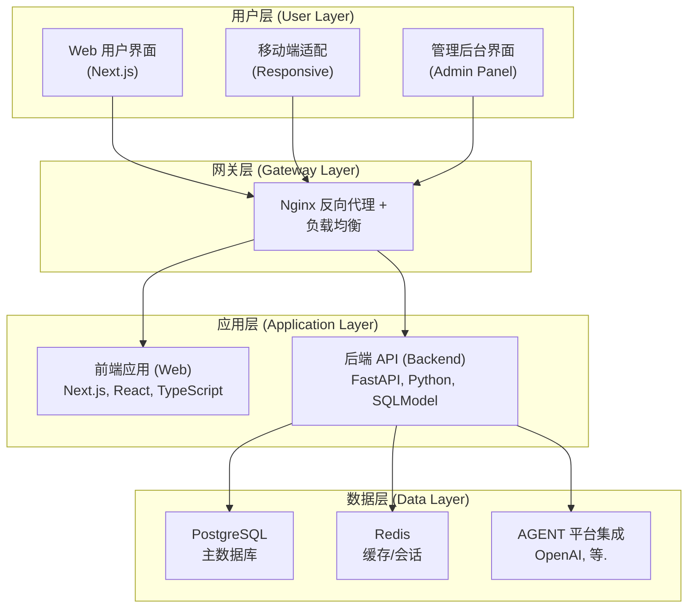

# RAIF: Remove AI Flavor

**RAIF (Remove AI Flavor)** 是一款智能文本优化工具，专注于去除 AI 生成文本的「机器味」，让内容更加自然、真实、富有人情味。通过先进的 AI 模型，将生硬的 AI 文本转化为流畅地道的人类表达，让你的内容更具温度和感染力。

[English README](README_EN.md)

> [!IMPORTANT]
> 🚀 **快速开始**：点击页面右上角的 [Use this template](https://github.com/open-v2ai/remove-ai-flavor/generate) 按钮创建您的新项目！

[在线演示 🔗](https://remove-ai-flavor.v2ai.org)

## 💡 为什么选择 RAIF？

在 AI 内容创作时代，我们面临一个共同的挑战：**如何让 AI 生成的文本更像人写的？**

RAIF 专门解决这个问题：

- **📝 告别机械感**：去除 AI 文本中常见的模板化表达、过度正式的语气
- **🎨 赋予人性化**：增加自然的表达方式、恰当的情感色彩、真实的语言节奏
- **⚡ 即时优化**：左右分栏实时对比，一键生成更自然的文本
- **🔄 保持原意**：在优化表达的同时，完整保留原文的核心信息和观点

## 🎯 核心功能

- **✨ 智能去 AI 味**：自动识别并优化机械化表达、套话、模板化语句
- **🎭 风格自定义**：可配置多种优化 Agent，适应不同场景和风格需求
- **📊 左右对比**：左侧输入 AI 原文，右侧实时展示优化结果，对比一目了然
- **💾 历史记录**：完整保存所有优化记录，随时查看和管理
- **🔐 数据安全**：本地化部署，数据完全掌控在自己手中
- **👥 会员体系**：支持免费版、月度版、年度版，灵活满足不同使用需求

## 🚀 核心特性

### ✨ 智能文本优化

- **去 AI 味核心引擎**：基于 LLM 的智能识别和优化，精准去除机械化表达
- **流式实时响应**：边生成边展示，即时查看优化效果
- **左右分栏对比**：原文和优化文本并排展示，修改点一目了然
- **多 Agent 支持**：可配置不同的优化模型和策略，满足不同场景需求
- **自动保存**：编辑内容自动保存到本地，刷新页面不丢失

### 👥 用户与权限

- **邮箱验证码登录**：无需密码，验证码登录更安全便捷
- **三级会员体系**：免费版、月度版、年度版，灵活满足不同需求
- **Token 用量统计**：实时追踪 Token 消耗，透明可控
- **优化次数限制**：根据会员等级设置每日优化次数和轮次限制
- **第一用户自动管理员**：首次注册用户自动获得管理员权限

### 📊 管理后台

- **数据可视化面板**：用户数、优化次数、Token 使用、订单收入等核心指标
- **用户管理**：查看、编辑、删除用户，管理会员状态
- **对话记录管理**：查看所有用户的优化记录和消息历史
- **Agent 配置**：创建和管理不同的优化 Agent，测试可用性
- **订单管理**：查看支付订单，跟踪收入情况

### 💳 支付与会员

- **Stripe 支付集成**：安全可靠的国际支付方案
- **会员自动激活**：支付成功后自动开通或续费会员
- **订单历史记录**：完整的订单信息和支付状态追踪
- **待支付订单管理**：支持查看和继续支付未完成订单

### 🌍 国际化与界面

- **中英文双语支持**：完整的国际化方案，覆盖所有界面和提示
- **响应式设计**：完美适配桌面端、平板和移动端
- **深色模式**：支持明暗主题自由切换，保护视力
- **现代化 UI**：基于 Shadcn UI，美观且易用

### 🛠️ 技术与部署

- **Docker 一键部署**：完整的容器化方案，快速启动生产环境
- **数据库版本管理**：Alembic 自动化迁移，升级无忧
- **Nginx 反向代理**：负载均衡和静态文件服务
- **Redis 缓存**：提升性能，支持会话管理

## 📦 技术栈

### 后端技术

| 技术 | 说明 | 版本 |
| --- | --- | --- |
| **FastAPI** | 现代化的 Python Web 框架 | Latest |
| **Python** | 后端开发语言 | 3.12+ |
| **PostgreSQL** | 关系型数据库 | Latest |
| **Redis** | 缓存和会话管理 | Latest |
| **SQLModel** | ORM 框架，结合 SQLAlchemy 和 Pydantic | Latest |
| **Alembic** | 数据库迁移工具 | Latest |
| **OpenAI API** | AI 模型接口（支持兼容接口） | Latest |
| **Stripe** | 支付系统集成 | Latest |
| **uv** | 现代化的 Python 包管理器 | 0.6+ |

### 前端技术

| 技术 | 说明 | 版本 |
| --- | --- | --- |
| **Next.js** | React 全栈框架 | 15.3+ |
| **React** | UI 库 | 19+ |
| **TypeScript** | 类型安全的 JavaScript | Latest |
| **Tailwind CSS** | 原子化 CSS 框架 | Latest |
| **Shadcn UI** | 高质量 React 组件库 | Latest |
| **next-intl** | Next.js 国际化方案 | Latest |
| **pnpm** | 快速的包管理器 | 10.11+ |

### 部署技术

| 技术 | 说明 |
| --- | --- |
| **Docker** | 容器化平台 |
| **Docker Compose** | 多容器编排 |
| **Nginx** | 反向代理和负载均衡 |

## ⚡ 快速开始

> [!WARNING]
> **最低系统要求**：
>
> - **CPU**：2 核
> - **内存**：4 GB
> - **存储**：20 GB

### 方式一：Docker 一键部署（推荐）

这是最简单快速的部署方式，适合快速体验和生产环境使用。

**前置要求:**

- Docker >= 26.0
- Docker Compose >= 2.25

**部署步骤:**

1. **克隆项目**

   ```bash
   git clone https://github.com/open-v2ai/remove-ai-flavor.git
   cd remove-ai-flavor/deploy/
   ```

2. **配置环境变量**

   ```bash
   # 复制环境变量模板
   cp .env.example .env
   # 编辑 .env 文件，配置必需的环境变量
   vim .env
   ```

   **必需配置项**：

   ```bash
   # AI 配置（必填）
   AGENT_API_KEY=sk-proj-***
   AGENT_BASE_URL=https://api.openai.ai/v1/chat/completions
   AGENT_MODEL_NAME=gpt-4.1-mini

   # 邮件配置（必填，用于登录验证码）
   # 方式一：使用 SMTP
   MAIL_SEND_METHOD=SMTP
   MAIL_USERNAME=your-email@gmail.com
   MAIL_PASSWORD=your-app-password
   MAIL_FROM=your-email@gmail.com
   MAIL_SERVER=smtp.gmail.com
   MAIL_PORT=587

   # 方式二：使用 Resend
   # MAIL_SEND_METHOD=RESEND
   # RESEND_API_KEY=re_your-resend-api-key
   # RESEND_MAIL_FROM=your-email@your-domain.com

   # Stripe 配置（必填，用于支付模块）
   STRIPE_PUBLIC_KEY=pk-test-***
   STRIPE_PRIVATE_KEY=sk-test-***
   STRIPE_WEBHOOK_SECRET=whsec-***

   # 安全配置（建议修改）
   AUTH_SECRET_KEY=your-super-secret-key-here
   ```

3. **打包镜像**

   ```bash
   make build-all
   ```

4. **启动服务**

   ```bash
   # 一键启动所有服务
   docker compose up -d

   # 查看服务状态
   docker compose ps

   # 查看日志（可选）
   docker compose logs -f
   ```

5. **访问应用**

- **用户界面**: <http://localhost:8081>
- **管理后台**: <http://localhost:8081/admin>
- **API 文档**: <http://localhost:8081/v1/api/docs>

### 方式二：开发环境运行

适合开发者进行功能开发和定制。

**前置要求:**

- **后端**：Python >= 3.12，uv >= 0.6
- **前端**：Node.js >= 18.19，pnpm >= 10.11

**运行步骤:**

1. **克隆仓库**

   ```bash
   git clone https://github.com/open-v2ai/remove-ai-flavor.git
   cd remove-ai-flavor
   ```

2. **运行数据库服务**

   ```bash
   # 运行 PostgreSQL
   bash api/scripts/run_postgres.sh

   # 运行 Redis
   bash api/scripts/run_redis.sh
   ```

3. **配置并运行后端**

   > 依赖要求：Python >= 3.12，uv >= 0.6

   ```bash
   cd api/

   # 安装依赖
   uv sync

   # 激活虚拟环境
   source venv/bin/activate  # Linux/macOS
   # 或 venv\Scripts\activate  # Windows

   # 配置环境变量
   cp .env.example .env
   # 编辑 .env 文件
   vim .env

   # AI 配置（必填）
   AGENT_API_KEY=sk-proj-***
   AGENT_BASE_URL=https://api.openai.ai/v1/chat/completions
   AGENT_MODEL_NAME=gpt-4.1-mini

   # 邮件配置（必填，用于登录验证码）
   # 方式一：使用 SMTP
   MAIL_SEND_METHOD=SMTP
   MAIL_USERNAME=your-email@gmail.com
   MAIL_PASSWORD=your-app-password
   MAIL_FROM=your-email@gmail.com
   MAIL_SERVER=smtp.gmail.com
   MAIL_PORT=587

   # 方式二：使用 Resend
   # MAIL_SEND_METHOD=RESEND
   # RESEND_API_KEY=re_your-resend-api-key
   # RESEND_MAIL_FROM=your-email@your-domain.com

   # Stripe 配置（必填，用于支付模块）
   STRIPE_PUBLIC_KEY=pk-test-***
   STRIPE_PRIVATE_KEY=sk-test-***
   STRIPE_WEBHOOK_SECRET=whsec-***

   # 运行数据库迁移（可选）
   alembic upgrade head

   # 启动开发服务器（端口 8000）
   python -m app.main
   ```

4. **配置支付模块**

   ```bash
   # 新开终端
   cd api/
   source venv/bin/activate

   # 登录 Stripe
   stripe login
   stripe listen --forward-to localhost:8000/api/v1/orders/stripe/webhook
   # 复制生成的 webhook 密钥到 .env 文件中
   STRIPE_WEBHOOK_SECRET=whsec_cexxx
   ```

5. **配置并运行前端**

   > 依赖要求：Node.js >= 18.19，pnpm >= 10.11

   ```bash
   # 新开终端
   cd web/

   # 安装依赖
   pnpm install

   # 配置环境变量
   cp .env.example .env
   vim .env
   # 加入 API 地址
   NEXT_PUBLIC_API_URL=http://localhost:8000

   # 启动开发服务器（端口 3000）
   pnpm dev
   ```

6. **访问应用**
   - **用户界面**: <http://localhost:3000>
   - **管理后台**: <http://localhost:3000/admin>
   - **API 文档**: <http://localhost:3000/v1/api/docs>

> [!NOTE]
>
> - **测试环境邮件配置**：可以设置 `AUTH_IS_DEBUG=True` 和 `AUTH_DEBUG_CODE=888888`，实现跳过邮件验证码直接登录或注册，便于本地开发和测试。
> - **自动管理员设置**：第一个通过邮箱验证注册的用户将自动成为管理员！

### 🚨 常见问题

- **服务启动失败**:
  - **检查端口占用**：Docker 部署确保 8081、8082 端口未被占用，开发环境执行确保 8000、3000、4000 端口未被占用。
  - **检查 Docker**：确保 Docker 服务正在运行。
  - **查看日志**：使用 `docker compose logs -f` 查看错误信息。
- **AGENT 响应失败**:
  - **检查 API Key**：确保 AGENT API Key 有效且有余额。
  - **检查网络**：确保服务器可以访问 AGENT API。
  - **检查模型**：确认模型名称正确（如 `gpt-4.1-mini`）。
- **邮件发送失败**:
  - **云厂商封禁**：大多数云厂商可能会封禁 SMTP 服务，可以使用 [Resend](https://resend.com/) 代替。
  - **测试环境**：可以设置 `AUTH_IS_DEBUG=True` 和 `AUTH_DEBUG_CODE=888888`，实现跳过邮件验证码直接登录，便于本地开发和测试。
- **支付模块配置失败**:
  - **检查 Stripe**：确保 Stripe 服务正在运行。
  - **检查 webhook 密钥**：确保 webhook 密钥正确。
  - **检查 Stripe 账户**：确保 Stripe 账户正确。

## 开发指南

### 系统架构图



### 目录结构

```text
remove-ai-flavor/
├── api/                    # 后端 API 服务
│   ├── app/
│   │   ├── models/         # SQLModel 数据模型
│   │   ├── schemas/        # Pydantic 验证模式
│   │   ├── routers/v1/     # API 路由定义
│   │   ├── crud/           # 数据库 CRUD 操作
│   │   ├── services/       # 业务逻辑服务
│   │   ├── agents/         # AI Agent 集成
│   │   ├── core/           # 核心配置
│   │   └── utils/          # 工具模块
│   ├── alembic/            # 数据库迁移
│   └── pyproject.toml      # Python 依赖配置
├── web/                    # 前端 Web 应用
│   ├── app/                # Next.js App Router
│   ├── components/         # React 组件
│   │   ├── admin/          # 后台管理模块
│   │   │   ├── pages/      # 管理页面
│   │   │   ├── dialogs/    # 对话框组件
│   │   │   ├── components/ # 功能组件
│   │   │   └── sidebar/    # 侧边栏组件
│   │   ├── web/            # 前台应用模块
│   │   │   ├── pages/      # 页面组件
│   │   │   ├── dialogs/    # 对话框
│   │   │   ├── chat/       # 聊天相关
│   │   │   ├── editor/     # 编辑器
│   │   │   ├── layout/     # 布局
│   │   │   └── sidebar/    # 侧边栏
│   │   ├── common/         # 共享组件
│   │   └── ui/             # Shadcn UI 基础组件
│   ├── i18n/               # 国际化配置
│   └── package.json        # 前端依赖配置
├── deploy/                 # 生产环境部署
└── deploy-test/            # 测试环境部署
```

### 开发流程

1. **后端开发**：在 `api/app/` 中添加数据模型、API 路由和业务逻辑
2. **数据库迁移**：使用 Alembic 管理数据库版本
3. **前端开发**：在 `web/components/` 中创建 React 组件
4. **样式开发**：使用 Tailwind CSS + Shadcn UI
5. **国际化**：在 `web/app/messages/` 中添加中英文翻译
6. **测试部署**：使用 `deploy-test/` 进行测试环境验证

## 贡献指南

我们欢迎对 RAIF 的贡献！更多信息请参阅我们的 [CONTRIBUTING.md](.github/CONTRIBUTING.md)。

## 许可证

RAIF 采用 [Apache License 2.0](LICENSE) 许可证发布。
