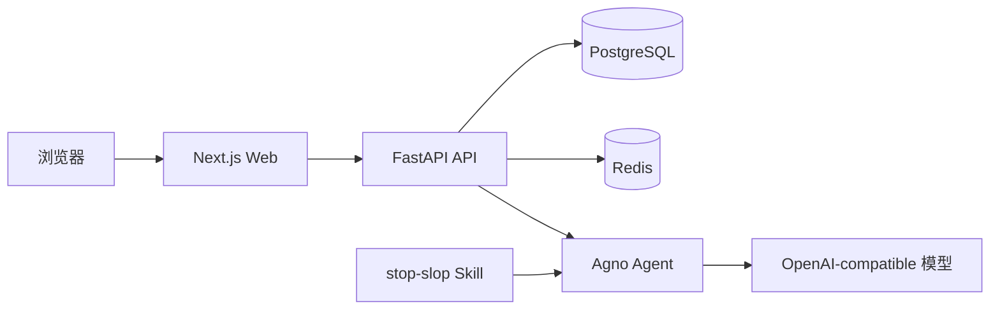

# RAIF：Remove AI Flavor

RAIF 是一款开源的文本优化工具，用于减少 AI 生成内容中的模板化表达、空泛套话和机械语气，同时尽量保留原文事实、观点、语言和 Markdown 结构。

[English](./README_EN.md) · [在线演示](https://remove-ai-flavor.v2ai.org) · [贡献指南](./.github/CONTRIBUTING.md)

## 主要功能

- **专业去 AI 味**：后端通过 Agno 调用 OpenAI-compatible 模型，并加载内置的 `stop-slop` Skill。
- **访客直接体验**：无需登录即可免费优化 3 次；额度按浏览器访客 ID 记录在 Redis 中，有效期为 30 天。
- **登录后完整使用**：支持邮箱验证码或密码登录、注册、重置密码、流式生成、停止生成、历史记录和新建优化任务。
- **左右对照编辑**：原文与优化结果并排展示，草稿自动保存在浏览器中。
- **分级 Agent 权限**：免费、月度和年度会员可访问不同级别的 Agent。
- **管理后台**：管理用户、对话、Agent、会员计划和订单，并测试模型连接。
- **中英文界面**：基于 `next-intl`，支持浅色与深色主题。
- **自托管部署**：提供 Docker Compose、PostgreSQL、Redis、Nginx 和 Stripe CLI 配置。

## 工作原理



登录用户的对话和消息保存在 PostgreSQL 中，会员与 Token 限额在请求前检查。访客请求不创建对话记录，只使用免费 Agent，并通过 Redis 原子预占和提交使用额度；模型调用失败不会消耗访客次数。

所有 Agent 来源标签最终都通过 Agno `OpenAILike` 适配层执行。`llm`、`fastgpt`、`coze` 和 `custom` 仅用于后台展示及 API 地址预设，不代表不同的运行时实现。

## 技术栈

- **后端**：Python 3.12、FastAPI 0.115、SQLModel、Alembic、PostgreSQL、Redis、Agno 2、Stripe。
- **前端**：Node.js 20、Next.js 15.3、React 19、TypeScript、Tailwind CSS 4、Shadcn UI、next-intl、Vitest。
- **工程化**：uv、pnpm、Docker、Docker Compose、Nginx。

## 快速开始

### 环境要求

- Python `>=3.12,<3.14`
- [uv](https://docs.astral.sh/uv/)
- Node.js `>=20`
- pnpm `>=9`
- PostgreSQL
- Redis

也可以只安装 Docker 26+ 和 Docker Compose 2.25+，使用容器运行完整服务。

### 1. 克隆仓库

```bash
git clone https://github.com/open-v2ai/remove-ai-flavor.git
cd remove-ai-flavor
```

### 2. 启动本地依赖

```bash
bash api/scripts/run_postgres.sh
bash api/scripts/run_redis.sh
```

### 3. 配置后端

```bash
cp api/.env.example api/.env
```

至少需要确认以下配置：

```dotenv
AUTH_SECRET_KEY=replace-with-a-random-secret

POSTGRES_HOST=localhost
POSTGRES_PORT=5432
POSTGRES_USER=postgres
POSTGRES_PASSWORD=123456
POSTGRES_DB=remove-ai-flavor

REDIS_HOST=localhost
REDIS_PORT=6379
REDIS_PASSWORD=123456

AGENT_API_KEY=sk-...
AGENT_BASE_URL=https://api.openai.com/v1/chat/completions
AGENT_MODEL_NAME=gpt-4.1-mini
AGENT_MODEL_TEMPERATURE=0.7
```

`AGENT_BASE_URL` 接受 OpenAI-compatible 基础地址，也兼容以 `/chat/completions` 结尾的完整地址。登录验证码还需要配置 SMTP 或 Resend；支付功能需要配置 Stripe。完整变量见 [`api/.env.example`](./api/.env.example)。

### 4. 配置前端

```bash
cp web/.env.example web/.env
```

开发环境默认配置：

```dotenv
NEXT_PUBLIC_API_URL=http://127.0.0.1:8000
NEXT_PUBLIC_APP_URL=http://127.0.0.1:3009
```

### 5. 安装依赖并迁移数据库

```bash
cd api
uv sync
uv run alembic upgrade head

cd ../web
pnpm install
```

### 6. 启动开发服务

在仓库根目录分别执行：

```bash
make dev-api
make dev-web
```

- Web：<http://localhost:3009>
- 管理后台：<http://localhost:3009/admin>
- API：<http://localhost:8000>
- OpenAPI：<http://localhost:8000/api/v1/docs>
- 健康检查：<http://localhost:8000/health>

本地调试登录时可在 `api/.env` 中设置 `AUTH_IS_DEBUG=True` 和 `AUTH_DEBUG_CODE=888888`。生产环境必须关闭调试模式并更换默认密钥。

## Docker 部署

```bash
cp deploy/.env.example deploy/.env
# 编辑 deploy/.env，替换所有示例密钥、密码、域名和模型配置

make build-all
make start
```

默认入口为 <http://localhost:8081>，API 文档位于 <http://localhost:8081/api/v1/docs>。

常用命令：

```bash
make logs
make restart
make stop
make rebuild
```

仓库提供 GitHub Actions 自动部署工作流：推送 `main` 分支后可通过 SSH 在服务器执行 `make deploy-ci`，也支持手动触发。所需 Secrets 和服务器初始化步骤见 [`deploy/README.md`](./deploy/README.md)。

## 测试与检查

```bash
# 后端
cd api
make test
make lint

# 前端
cd ../web
pnpm test
pnpm build
make i18n-check

# Markdown（仓库根目录）
cd ..
pnpm lint:md
```

涉及数据库模型的修改必须同时提供 Alembic 迁移。涉及界面文案的修改必须同步更新 `web/app/messages/zh.json` 和 `web/app/messages/en.json`。

## 目录结构

```text
remove-ai-flavor/
├── api/
│   ├── alembic/               # 数据库迁移
│   ├── app/
│   │   ├── agents/            # Agno 运行时适配
│   │   ├── skills/stop-slop/  # 内置去 AI 味 Skill
│   │   ├── routers/v1/        # API 路由
│   │   ├── services/          # 会员、访客额度等业务逻辑
│   │   ├── models/            # SQLModel 数据模型
│   │   └── schemas/           # Pydantic 模型
│   └── tests/                 # pytest 测试
├── web/
│   ├── app/                   # Next.js App Router 与翻译
│   ├── components/            # 前台、后台与 UI 组件
│   └── util/                  # 访客额度、登录和任务工具
├── deploy/                    # Docker Compose 与 Nginx
├── .cursor/rules/             # Cursor 项目规则
├── AGENTS.md                  # 编码代理协作说明
└── Makefile                   # 根目录开发与部署入口
```

## 进一步阅读

- [文档索引](./docs/README.md)
- [后端开发说明](./api/README.md)
- [前端开发说明](./web/README.md)
- [部署指南](./deploy/README.md)
- [贡献指南](./.github/CONTRIBUTING.md)
- [编码代理说明](./AGENTS.md)
- [stop-slop 来源与许可证](./api/app/skills/stop-slop/UPSTREAM.md)

## 安全说明

- 不要提交 `.env`、API Key、JWT 密钥、数据库密码或 Stripe 密钥。
- 生产环境必须使用强密码、HTTPS，并限制 PostgreSQL 与 Redis 的公网访问。
- 普通用户接口不会返回 Agent API Key；新增接口时也必须维持此边界。
- `AUTH_IS_DEBUG` 和 `API_RELOAD` 不应在生产环境开启。

## 贡献与许可证

欢迎提交 Issue 和 Pull Request。开始前请阅读[贡献指南](./.github/CONTRIBUTING.md)和[行为准则](./.github/CODE_OF_CONDUCT.md)。

项目基于 [Apache License 2.0](./LICENSE) 发布。
