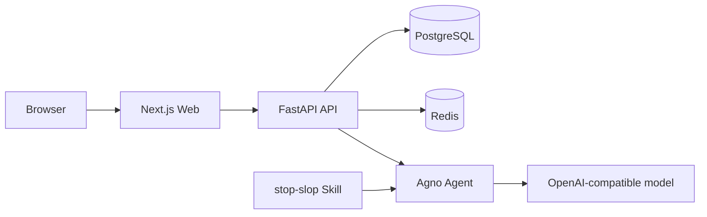

# RAIF: Remove AI Flavor

RAIF is an open-source text optimization tool that reduces formulaic phrasing, empty filler, and mechanical tone in AI-generated writing while preserving the source facts, viewpoint, language, and Markdown structure.

[中文](./README.md) · [Live demo](https://remove-ai-flavor.v2ai.org) · [Contributing](./.github/CONTRIBUTING_EN.md)

## Features

- **Focused AI-flavor removal**: the backend uses Agno with an OpenAI-compatible model and the bundled `stop-slop` Skill.
- **Guest access**: visitors can optimize three texts without signing in. Usage is stored in Redis for 30 days against a browser-generated guest ID.
- **Full signed-in workflow**: email-code or password login, registration, password reset, streaming generation, cancellation, history, and new optimization tasks.
- **Side-by-side editor**: compare source and optimized text while browser storage keeps the current draft.
- **Tiered Agent access**: free, monthly, and yearly members receive access to different Agent levels.
- **Administration**: manage users, chats, Agents, membership plans, and orders, and test model connections.
- **Bilingual interface**: Chinese and English UI with light and dark themes.
- **Self-hosting**: Docker Compose configuration for PostgreSQL, Redis, Nginx, and Stripe CLI.

## How it works



Authenticated chats and messages are stored in PostgreSQL, with membership and token limits checked before model execution. Guest requests do not create chat history: they use a free Agent and reserve usage atomically in Redis. Failed model calls do not consume a guest use.

Every Agent source label is executed through the Agno `OpenAILike` adapter. The `llm`, `fastgpt`, `coze`, and `custom` values are display labels and API URL presets, not separate runtime implementations.

## Stack

- **Backend**: Python 3.12, FastAPI 0.115, SQLModel, Alembic, PostgreSQL, Redis, Agno 2, and Stripe.
- **Frontend**: Node.js 20, Next.js 15.3, React 19, TypeScript, Tailwind CSS 4, Shadcn UI, next-intl, and Vitest.
- **Tooling**: uv, pnpm, Docker, Docker Compose, and Nginx.

## Quick start

### Requirements

- Python `>=3.12,<3.14`
- [uv](https://docs.astral.sh/uv/)
- Node.js `>=20`
- pnpm `>=9`
- PostgreSQL
- Redis

Alternatively, install Docker 26+ and Docker Compose 2.25+ to run the complete stack in containers.

### 1. Clone

```bash
git clone https://github.com/open-v2ai/remove-ai-flavor.git
cd remove-ai-flavor
```

### 2. Start local dependencies

```bash
bash api/scripts/run_postgres.sh
bash api/scripts/run_redis.sh
```

### 3. Configure the API

```bash
cp api/.env.example api/.env
```

Review at least these values:

```dotenv
AUTH_SECRET_KEY=replace-with-a-random-secret

POSTGRES_HOST=localhost
POSTGRES_PORT=5432
POSTGRES_USER=postgres
POSTGRES_PASSWORD=123456
POSTGRES_DB=remove-ai-flavor

REDIS_HOST=localhost
REDIS_PORT=6379
REDIS_PASSWORD=123456

AGENT_API_KEY=sk-...
AGENT_BASE_URL=https://api.openai.com/v1/chat/completions
AGENT_MODEL_NAME=gpt-4.1-mini
AGENT_MODEL_TEMPERATURE=0.7
```

`AGENT_BASE_URL` accepts either an OpenAI-compatible base URL or a full URL ending in `/chat/completions`. Configure SMTP or Resend for sign-in codes and Stripe for payments. See [`api/.env.example`](./api/.env.example) for the complete list.

### 4. Configure the web app

```bash
cp web/.env.example web/.env
```

Development defaults:

```dotenv
NEXT_PUBLIC_API_URL=http://127.0.0.1:8000
NEXT_PUBLIC_APP_URL=http://127.0.0.1:3009
```

### 5. Install and migrate

```bash
cd api
uv sync
uv run alembic upgrade head

cd ../web
pnpm install
```

### 6. Run development servers

Run each command from the repository root in a separate terminal:

```bash
make dev-api
make dev-web
```

- Web: <http://localhost:3009>
- Admin: <http://localhost:3009/admin>
- API: <http://localhost:8000>
- OpenAPI: <http://localhost:8000/api/v1/docs>
- Health: <http://localhost:8000/health>

For local sign-in testing, set `AUTH_IS_DEBUG=True` and `AUTH_DEBUG_CODE=888888` in `api/.env`. Never enable debug authentication or retain sample secrets in production.

## Docker deployment

```bash
cd deploy
cp .env.example .env
# Replace all sample secrets, passwords, domains, and model settings.

make build-all
make start
```

The default entry point is <http://localhost:8081>, with OpenAPI at <http://localhost:8081/api/v1/docs>.

Common commands:

```bash
make logs
make restart
make stop
make rebuild
```

The repository includes a GitHub Actions deployment workflow. A push to `main` can run `make deploy-ci` on the server over SSH, and the workflow can also be triggered manually. See [`deploy/README.md`](./deploy/README.md) for the required secrets and server setup.

## Tests and checks

```bash
# Backend
cd api
make test
make lint

# Frontend
cd ../web
pnpm test
pnpm build
make i18n-check

# Markdown (repository root)
cd ..
pnpm lint:md
```

Database model changes must include an Alembic migration. UI copy changes must update both `web/app/messages/zh.json` and `web/app/messages/en.json`.

## Repository layout

```text
remove-ai-flavor/
├── api/
│   ├── alembic/               # Database migrations
│   ├── app/
│   │   ├── agents/            # Agno runtime adapter
│   │   ├── skills/stop-slop/  # Bundled writing Skill
│   │   ├── routers/v1/        # API routes
│   │   ├── services/          # Membership and guest usage logic
│   │   ├── models/            # SQLModel tables
│   │   └── schemas/           # Pydantic schemas
│   └── tests/                 # pytest tests
├── web/
│   ├── app/                   # Next.js routes and translations
│   ├── components/            # Product, admin, and UI components
│   └── util/                  # Guest, login, and task utilities
├── deploy/                    # Docker Compose and Nginx
├── .cursor/rules/             # Cursor project rules
├── AGENTS.md                  # Coding-agent instructions
└── Makefile                   # Root development and deployment entry point
```

## Documentation

- [Documentation index](./docs/README_EN.md)
- [Backend guide](./api/README.md)
- [Frontend guide](./web/README.md)
- [Deployment guide](./deploy/README.md)
- [Contributing guide](./.github/CONTRIBUTING_EN.md)
- [Coding-agent instructions](./AGENTS.md)
- [stop-slop provenance and license](./api/app/skills/stop-slop/UPSTREAM.md)

## Security

- Never commit `.env` files, API keys, JWT secrets, database passwords, or Stripe secrets.
- Production deployments require strong passwords, HTTPS, and restricted PostgreSQL and Redis access.
- Public Agent responses exclude upstream API keys; new endpoints must preserve this boundary.
- Do not enable `AUTH_IS_DEBUG` or `API_RELOAD` in production.

## Contributing and license

Issues and pull requests are welcome. Read the [contributing guide](./.github/CONTRIBUTING_EN.md) and [code of conduct](./.github/CODE_OF_CONDUCT_EN.md) before starting.

RAIF is released under the [Apache License 2.0](./LICENSE).
