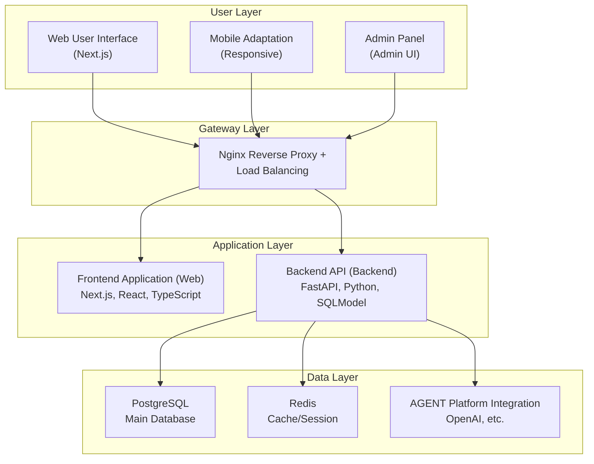

# RAIF: Remove AI Flavor

**RAIF (Remove AI Flavor)** is an intelligent text optimization tool specifically designed to remove the mechanical feel of AI-generated articles, making content more natural and human-like. Built with `FastAPI` + `Next.js` tech stack and powered by advanced AI models, it helps users transform AI-generated text into fluent, authentic human writing style.

[中文 README](README.md)

> [!IMPORTANT]
> 🚀 **Quick Start**: Click the [Use this template](https://github.com/open-v2ai/remove-ai-flavor/generate) button in the top right corner of the page to create your new project!

[Live Demo 🔗](https://remove-ai-flavor.v2ai.org)

## 🎯 Project Highlights

- **✨ AI Flavor Removal**: Intelligently identifies and optimizes mechanical traces in AI-generated text.
- **🎨 Style Diversity**: Supports multiple writing style transformations (formal/conversational/literary, etc.).
- **📝 Real-time Polish**: Streaming response for instant text optimization effects.
- **📱 Modern Interface**: Beautiful responsive design based on Shadcn UI.
- **🔒 Data Security**: Comprehensive user authentication and privacy protection.
- **📊 Usage Statistics**: Detailed optimization records and admin dashboard.

## Core Features

### ✨ AI Text Optimization

- [x] **Smart AI Flavor Removal**: Automatically identifies and optimizes AI-generated traces.
- [x] **Multiple Optimization Modes**: Supports various degrees of text rewriting and polishing.
- [x] **Style Customization**: Choose from formal, conversational, literary, and more styles.
- [x] **Streaming Display**: Real-time view of text optimization process.

### 👥 User Management System

- [x] **Email Verification Code Login**: Secure and convenient passwordless login with email verification.
- [x] **Membership System**: Supports multiple tiers like Free, Monthly, and Yearly plans.
- [x] **Permission Management**: Separation of user and administrator roles.

### 📝 Text Processing

- [x] **Batch Optimization**: Process multiple text segments simultaneously.
- [x] **History Records**: Complete optimization records and management.
- [x] **Comparison View**: Side-by-side display of original and optimized text.

### 🛠 Admin Dashboard

- [x] **Data Analytics**: Visualization of core data like users, optimizations, and token usage.
- [x] **User Management**: View, edit, delete users, and manage permissions.
- [x] **Model Management**: Create, configure, and monitor AI models.

### 🌍 Internationalization & UI

- [x] **Multi-language Support**: Complete internationalization for Chinese and English.
- [x] **Responsive Design**: Perfectly adapts to both desktop and mobile devices.
- [x] **Dark Mode**: Supports switching between light and dark themes.

### 🚀 Deployment & Operations

- [x] **Docker Deployment**: A complete containerized deployment solution.
- [x] **Database Migration**: Automated database version management with Alembic.
- [x] **Reverse Proxy**: Nginx for load balancing and static file serving.

## Tech Stack

### Backend Technologies

- **Framework**: FastAPI + Python 3.12
- **Database**: PostgreSQL + SQLModel + Alembic + Redis
- **AI Integration**: OpenAI API + Multi-platform Agent support
- **Authentication**: JWT + Email verification code
- **Package Manager**: uv

### Frontend Technologies

- **Framework**: Next.js 15.3 + React 19 + TypeScript
- **UI Components**: Shadcn UI + Tailwind CSS
- **Internationalization**: next-intl
- **State Management**: React Hooks
- **Package Manager**: pnpm

### Deployment Technologies

- **Containerization**: Docker + Docker Compose
- **Reverse Proxy**: Nginx
- **Data Persistence**: PostgreSQL + Redis data volumes

## ⚡ Quick Start

> [!WARNING]
> **Minimum System Requirements**:
>
> - **CPU**: 2 Cores
> - **Memory**: 4 GB
> - **Storage**: 20 GB

### Method 1: Docker One-click Deployment (Recommended)

This is the simplest and fastest way to deploy, suitable for quick trials and production environments.

**Prerequisites:**

- Docker >= 26.0
- Docker Compose >= 2.25

**Deployment Steps:**

1. **Clone the project**

   ```bash
   git clone https://github.com/open-v2ai/remove-ai-flavor.git
   cd remove-ai-flavor/deploy/
   ```

2. **Configure environment variables**

   ```bash
   # Copy the environment variable template
   cp .env.example .env
   # Edit the .env file to configure the necessary environment variables
   vim .env
   ```

   **Required configurations**:

   ```bash
   # AGENT Configuration (required)
   AGENT_API_KEY=sk-proj-***
   AGENT_BASE_URL=https://api.openai.ai/v1/chat/completions
   AGENT_MODEL_NAME=gpt-4.1-mini

   # Mail Configuration (required for login verification codes)
   # Method 1: Use SMTP
   MAIL_SEND_METHOD=SMTP
   MAIL_USERNAME=your-email@gmail.com
   MAIL_PASSWORD=your-app-password
   MAIL_FROM=your-email@gmail.com
   MAIL_SERVER=smtp.gmail.com
   MAIL_PORT=587

   # Method 2: Use Resend
   # MAIL_SEND_METHOD=RESEND
   # RESEND_API_KEY=re_your-resend-api-key
   # RESEND_MAIL_FROM=your-email@your-domain.com

   # Stripe Configuration (required for payment module)
   STRIPE_PUBLIC_KEY=pk-test-***
   STRIPE_PRIVATE_KEY=sk-test-***
   STRIPE_WEBHOOK_SECRET=whsec-***

   # Security Configuration (recommended to change)
   AUTH_SECRET_KEY=your-super-secret-key-here
   ```

3. **Build images**

   ```bash
   make build-all
   ```

4. **Start the services**

   ```bash
   # Start all services with one command
   docker compose up -d

   # Check service status
   docker compose ps

   # View logs (optional)
   docker compose logs -f
   ```

5. **Access the application**

- **User Interface**: <http://localhost:8081>
- **Admin Dashboard**: <http://localhost:8081/admin>
- **API Docs**: <http://localhost:8081/v1/api/docs>

### Method 2: Development Environment

Suitable for developers for feature development and customization.

**Prerequisites:**

- **Backend**: Python >= 3.12, uv >= 0.6
- **Frontend**: Node.js >= 18.19, pnpm >= 10.11

**Execution Steps:**

1. **Clone the repository**

   ```bash
   git clone https://github.com/open-v2ai/remove-ai-flavor.git
   cd remove-ai-flavor
   ```

2. **Run database services**

   ```bash
   # Run PostgreSQL
   bash api/scripts/run_postgres.sh

   # Run Redis
   bash api/scripts/run_redis.sh
   ```

3. **Configure and run the backend**

   > Requirements: Python >= 3.12, uv >= 0.6

   ```bash
   cd api/

   # Install dependencies
   uv sync

   # Activate virtual environment
   source venv/bin/activate  # Linux/macOS
   # Or venv\Scripts\activate  # Windows

   # Configure environment variables
   cp .env.example .env
   # Edit the .env file
   vim .env

   # AI Configuration (required)
   AGENT_API_KEY=sk-proj-***
   AGENT_BASE_URL=https://api.openai.ai/v1/chat/completions
   AGENT_MODEL_NAME=gpt-4.1-mini

   # Mail Configuration (required for login verification codes)
   # Method 1: Use SMTP
   MAIL_SEND_METHOD=SMTP
   MAIL_USERNAME=your-email@gmail.com
   MAIL_PASSWORD=your-app-password
   MAIL_FROM=your-email@gmail.com
   MAIL_SERVER=smtp.gmail.com
   MAIL_PORT=587

   # Method 2: Use Resend
   # MAIL_SEND_METHOD=RESEND
   # RESEND_API_KEY=re_your-resend-api-key
   # RESEND_MAIL_FROM=your-email@your-domain.com

   # Stripe Configuration (required for payment module)
   STRIPE_PUBLIC_KEY=pk-test-***
   STRIPE_PRIVATE_KEY=sk-test-***
   STRIPE_WEBHOOK_SECRET=whsec-***

   # Run database migrations (optional)
   alembic upgrade head

   # Start development server (port 8000)
   python -m app.main
   ```

4. **Configure Payment Module**

   ```bash
   # Open a new terminal
   cd api/
   source venv/bin/activate

   # Login to Stripe
   stripe login
   stripe listen --forward-to localhost:8000/api/v1/orders/stripe/webhook
   # Copy the generated webhook secret to the .env file
   STRIPE_WEBHOOK_SECRET=whsec_cexxx
   ```

5. **Configure and run the frontend**

   > Requirements: Node.js >= 18.19, pnpm >= 10.11

   ```bash
   # Open a new terminal
   cd web/

   # Install dependencies
   pnpm install

   # Configure environment variables
   cp .env.example .env
   vim .env
   # Add API address
   NEXT_PUBLIC_API_URL=http://localhost:8000

   # Start development server (port 3000)
   pnpm dev
   ```

6. **Access the application**
   - **User Interface**: <http://localhost:3000>
   - **Admin Dashboard**: <http://localhost:3000/admin>
   - **API Docs**: <http://localhost:3000/v1/api/docs>

> [!NOTE]
>
> - **Testing Environment Mail Configuration**: You can set `AUTH_IS_DEBUG=True` and `AUTH_DEBUG_CODE=888888` to bypass email verification for direct login or registration, which is convenient for local development and testing.
> - **Auto Admin Setup**: The first user to register via email verification will automatically become an administrator!

### 🚨 Common Issues

- **Service fails to start**:
  - **Check for port conflicts**: For Docker deployment, ensure ports 8081 and 8082 are not in use. For the development environment, ensure ports 8000, 3000, and 4000 are not occupied.
  - **Check Docker**: Make sure the Docker service is running.
  - **View logs**: Use `docker compose logs -f` to check for error messages.
- **AGENT fails to respond**:
  - **Check API Key**: Ensure the AGENT API Key is valid and has a sufficient balance.
  - **Check network**: Ensure the server can access the AGENT API.
  - **Check model**: Confirm the model name is correct (e.g., `gpt-4.1-mini`).
- **Email fails to send**:
  - **Cloud Provider Blocking**: Most cloud providers may block SMTP services. You can use [Resend](https://resend.com/) as an alternative.
  - **Testing Environment**: You can set `AUTH_IS_DEBUG=True` and `AUTH_DEBUG_CODE=888888` to bypass email verification for direct login, which is convenient for local development and testing.
- **Payment module configuration failed**:
  - **Check Stripe**: Ensure the Stripe service is running.
  - **Check webhook secret**: Make sure the webhook secret is correct.
  - **Check Stripe account**: Verify that the Stripe account is set up correctly.

## Development Guide

### System Architecture Diagram



### Directory Structure

```text
remove-ai-flavor/
├── api/                    # Backend API service
│   ├── app/
│   │   ├── models/         # SQLModel data models
│   │   ├── schemas/        # Pydantic validation schemas
│   │   ├── routers/v1/     # API route definitions
│   │   ├── crud/           # Database CRUD operations
│   │   ├── services/       # Business logic services
│   │   ├── agents/         # AI Agent integrations
│   │   ├── core/           # Core configurations
│   │   └── utils/          # Utility modules
│   ├── alembic/            # Database migrations
│   └── pyproject.toml      # Python dependency config
├── web/                    # Frontend Web application
│   ├── app/                # Next.js App Router
│   ├── components/         # React components
│   │   ├── admin/          # Admin management module
│   │   │   ├── pages/      # Management pages
│   │   │   ├── dialogs/    # Dialog components
│   │   │   ├── components/ # Functional components
│   │   │   └── sidebar/    # Sidebar components
│   │   ├── web/            # Frontend application module
│   │   │   ├── pages/      # Page components
│   │   │   ├── dialogs/    # Dialogs
│   │   │   ├── chat/       # Chat related
│   │   │   ├── editor/     # Editor
│   │   │   ├── layout/     # Layout
│   │   │   └── sidebar/    # Sidebar
│   │   ├── common/         # Shared components
│   │   └── ui/             # Shadcn UI base components
│   ├── i18n/               # Internationalization config
│   └── package.json        # Frontend dependency config
├── deploy/                 # Production deployment
└── deploy-test/            # Test environment deployment
```

### Development Workflow

1. **Backend Development**: Add data models, API routes, and business logic in `api/app/`.
2. **Database Migration**: Use Alembic to manage database versions.
3. **Frontend Development**: Create React components in `web/components/`.
4. **Styling**: Use Tailwind CSS + Shadcn UI.
5. **Internationalization**: Add translations for Chinese and English in `web/app/messages/`.
6. **Test Deployment**: Use `deploy-test/` for test environment validation.

## Contributing

We welcome contributions to RAIF! For more information, please see our [CONTRIBUTING.md](.github/CONTRIBUTING_EN.md).

## License

RAIF is released under the [Apache License 2.0](LICENSE).
